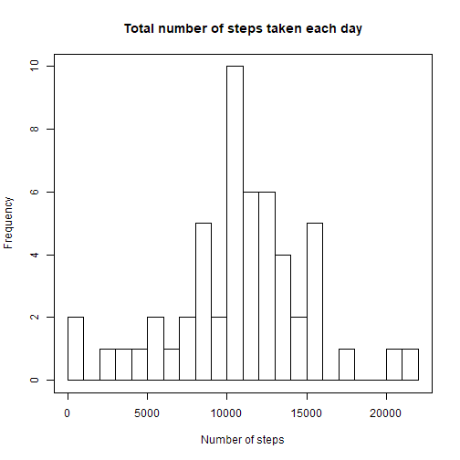
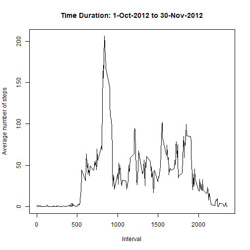
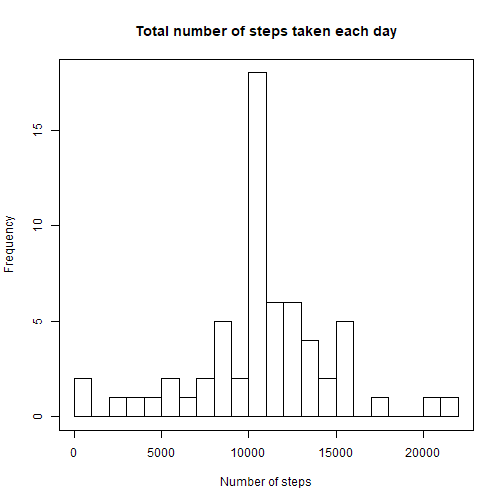
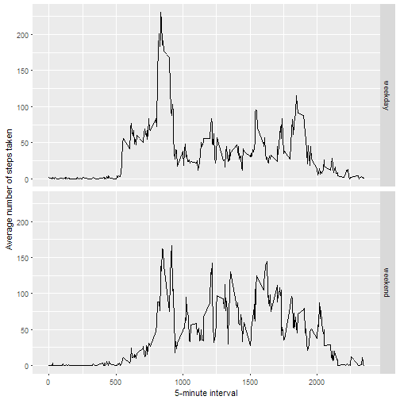

---
title: "Course Project 1"
author: "Abhishek Mehrotra"
date: "1 September 2017"
output: html_document
---  
## Activity Monitoring Data
  
It is now possible to collect a large amount of data about personal movement using activity monitoring devices such as a [Fitbit][1], [Nike Fuelband][2], or [Jawbone Up][3]. These type of devices are part of the "*quantified self*" movement - a group of enthusiasts who take measurements about themselves regularly to improve their health, to find patterns in their behavior, or because they are tech geeks. But these data remain under-utilized both because the raw data are hard to obtain and there is a lack of statistical methods and software for processing and interpreting the data.  
  
This assignment makes use of data from a personal activity monitoring device. This device collects data at 5 minute intervals through out the day. The data consists of two months of data from an anonymous individual collected during the months of October and November, 2012 and include the number of steps taken in 5 minute intervals each day.  
  
The data for this assignment is here: [Activity monitoring data][4]  
  
The variables included in this dataset are:  

- steps: Number of steps taking in a 5-minute interval (missing values are coded as NA)
- date: The date on which the measurement was taken in YYYY-MM-DD format
- interval: Identifier for the 5-minute interval in which measurement was taken  
  
The dataset is stored in a comma-separated-value (CSV) file and there are a total of 17,568 observations in this dataset.  


  
### Loading and preprocessing the data

```r
activity <- read.csv(file = "./activity.csv", header = T, na.strings = "NA")
activity$date <- as.Date(activity$date, format = "%Y-%m-%d")
str(activity)
```

```
## 'data.frame':	17568 obs. of  3 variables:
##  $ steps   : int  NA NA NA NA NA NA NA NA NA NA ...
##  $ date    : Date, format: "2012-10-01" "2012-10-01" ...
##  $ interval: int  0 5 10 15 20 25 30 35 40 45 ...
```

#### Calculation of the total steps per day, and the mean and median of the total steps per day:

```r
dailysteps <- aggregate(steps ~ date, data = activity, FUN=sum)
mean_steps <- mean(dailysteps$steps)
median_steps <- median(dailysteps$steps)
```

#### Histogram of the total number of steps taken each day:

```r
hist(x = dailysteps$steps, breaks = 20, main = "Total number of steps taken each day", 
     xlab = "Number of steps")
box()
```



- Mean of the total number of steps taken per day = 10766.19.
- Median of the total number of steps taken per day = 10765.

#### Time series plot of the 5-minute interval (x-axis) and the average number of steps taken, averaged across all days (y-axis)

```r
interval_steps <- aggregate(steps ~ interval, data = activity, FUN = mean)

with(interval_steps, {
    plot(interval, steps, type="l", xlab = "Interval", 
         ylab = "Average number of steps")
         title(main = "Time Duration: 1-Oct-2012 to 30-Nov-2012")
})
```



### What is mean total number of steps taken per day?  

#### Calculation of the total number of steps per 5-minute interval, across all days

```r
sum_interval <- aggregate(steps ~ interval, data = activity, FUN = sum)

max_interval <- sum_interval[sum_interval$steps==max(sum_interval$steps), ]$interval
```
- The 5-minute interval containing the maximum number of steps, on average across all the days in the dataset is 835.


### Imputing missing values
#### Calculation of the total number of missing values in the dataset

```r
na_count <- sum(is.na(activity))
```
- The total number of missing values in the dataset = 2304.
  
All missing (NA) values for the "steps" variable are imputed by replacing them by the mean value of the steps for the corresponding interval. This imputation is done in a new dataset called *imputed_activity*.

```r
imputed_activity <- activity

for(i in 1:nrow(imputed_activity)){
    if(is.na(imputed_activity$steps[i])){
        imputed_activity$steps[i] <- interval_steps[interval_steps$interval == imputed_activity$interval[i], ]$steps
    }
}
```

#### Histogram of the total number of steps taken each day (using the imputed dataset)

```r
imputed_dailysteps <- aggregate(steps ~ date, data = imputed_activity, FUN = sum)
imputed_meansteps <- mean(imputed_dailysteps$steps)
imputed_mediansteps <- median(imputed_dailysteps$steps)

hist(x = imputed_dailysteps$steps, breaks = 20, main = "Total number of steps taken each day", 
     xlab = "Number of steps")
box()
```



- Mean of the total number of steps taken per day = 10766.19
- Median of the total number of steps taken per day = 10766.19
  
  Clearly, there is no impact on the mean value of the total number of steps taken per day. However, the median changes from *10765* to the mean value, i.e., *10766.19*.  
   
Also, the total number of steps taken per day increases after imputing the missing data.  
  
### Are there differences in activity patterns between weekdays and weekends?
- A new factor variable is inserted in the imputed dataset (imputed_activity) with two levels - "weekday" and "weekend" indicating whether a given date is a weekday or weekend day.

```r
day <- weekdays(imputed_activity$date)
wday <- ifelse(day %in% c("Saturday","Sunday"), "weekend", "weekday")
imputed_activity$wday = factor(x=wday, labels = c("weekday", "weekend"))
```


#### Panel plot containing a time series plot of the 5-minute interval (x-axis) and the average number of steps taken, averaged across all weekday days or weekend days (y-axis)

```r
imputed_meandailysteps <- aggregate(steps ~ interval*wday, data = imputed_activity, FUN = mean)

g <- ggplot(data = imputed_meandailysteps, aes(x=interval, y=steps))
g + geom_line() + facet_grid(facets = wday ~ .) + labs(x = "5-minute interval") + 
    labs(y = "Average number of steps taken")
```



[1]: http://www.fitbit.com/ "Fitbit"
[2]: http://www.nike.com/us/en_us/c/nikeplus-fuelband "Nike Fuelband"
[3]: https://jawbone.com/up "Jawbone Up"
[4]: https://d396qusza40orc.cloudfront.net/repdata%2Fdata%2Factivity.zip "Activity Monitoring Dataset"
